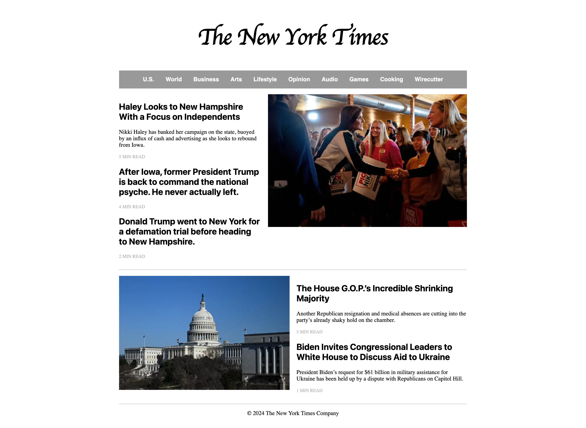

# recreation-of-NYTimes

This project recreates the New York Times web page with HTML and CSS. It employs CSS responsive flex design and provides responsive views for desktop & mobile devices.

For Desktop:

For Mobile: 

<!-- {:height="500px"} -->
